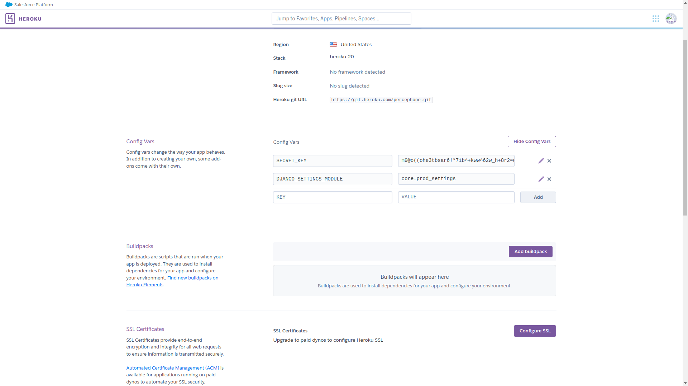

# Heroku Django Project (HDP)

<br/>
<br/>

## Installation

### Installation de python3
```
sudo apt install python3
sudo apt install python3-pip
```
Il faut s'assurer de la version de python qui est installée. La version de python
utilisée est `python 3.9.7`. Vous pouvez aussi utiliser version version `3.8`.

<br/>

### Installation de venv
```
sudo apt install python3-venv
```
OU
```
sudo pip3 install virtualenv
```
<br/>

### Créer un environnement virtuel
```
python3 -m venv env
```
OU
```
virtualenv env -p python3
```
<br/>

### Démarrage de l'environnement
```
source env/bin/activate
```
<br/>

### Installation des dépendances
```
pip install -r requirements.txt
```
<br/>
<br/>

## Configuration du projet

### Configuration de la base de données
Le système de gestion de base de données utilisé est `PostgreSQL`. Pour l'installer,
tapez la commande suivante :
```
sudo apt install postgresql
```

Démarrez ensuite le service du SGBDR avec la commande suivante:
```
sudo service postgresql start
```
Connectez vous en mode `root` avec les deux commandes suivantes :
```
sudo su - postgres
```
```
psql
```
<br/>

### Création de la base de données
La création de la base de données se fera en deux parties:
<br/>

- Première partie
Exécutez les trois commandes SQL suivantes :
1. Création d'un utilisateur :
```sql
CREATE USER user_name WITH ENCRYPTED PASSWORD 'secretpassword' LOGIN NOCREATEDB;
```

2. Création de la base de données pour l'utilisateur précédement créé :
```sql
CREATE DATABASE db_name OWNER user_name;
```

3. Attribution du droit de connexion à la base de données à l'utilisateur :
```sql
GRANT CONNECT ON DATABASE db_name TO user_name;
```
Déconnectez vous enfin du SGBDR en faisant deux fois `CTRL + D`.
<br/>

- Seconde partie
1. Il faut créer un fichier `.env` à la racine du dossier du projet.
```
touch .env
```

2. Insérer les informations suivantes dans le fichier `.env` :
```
USERDB=user_name
PASSWORDDB=secretpassword
DB=db_name
HOST=127.0.0.1
PORT=5432
```
`PS` : Si le port `5432` ne marche pas, alors essayez avec le port `5433`.

3. Exécutez les commandes suivantes pour faire la migration 
des modèles de base de données
```
./manage.py makemigrations
```
```
./manage.py migrate
```
<br/>

### Création d'un super utilisateur pour l'espace admin
```
./manage.py createsuperuser
```

Vous pouvez renseigner juste le `username` et le `password`.
<br/>

### Démarrage du serveur de django
```
./manage.py runserver
```
Résultats dans le terminal, qui indique que tout va bien est :
```
Watching for file changes with StatReloader
Performing system checks...

System check identified no issues (0 silenced).
January 21, 2022 - 07:53:49
Django version 3.2.6, using settings 'docs.settings'
Starting development server at http://127.0.0.1:8000/
Quit the server with CONTROL-C.
```

<br/>
<br/>


## Hébergement du serveur sur Heroku
Concernant l'hébergement du serveur sur Heroku, tu dois faire les choses suivantes:
1. créer l'application sur Heroku en premier;
2. clonner ce projet dans votre répertoire de travail;
3. redéfinir l'URL HOST du serveur de l'application dans le fichier `core/prod_settings.py`;
4. sur héroku, au niveau des configurations de ton application, définir deux variables dans 
les variables d'environnement : `SECRET_KEY` et `DJANGO_SETTINGS_MODULE` qui représentes respectievement
la `clé secrete` utilisée par le serveur et le fichier de `configuration globale du projet Django`;
5. connecter l'application créée sur Heroku à ton l'application;
6. Envoyer l'application par `Git` au serveur Heroku.

<br/>

### Clonner ce projet dans votre répertoire de travail
```sh
git clone git@github.com:CodiTheck/heroku-django.git
```

<br/>

### Redéfinir l'URL HOST du serveur
Tu dois redéfinir l'URL HOST du serveur de l'application dans le fichier `core/prod_settings.py`
```python
import dj_database_url
from core.settings import *
from stdlib import get_env_var


DEBUG = False;
TEMPLATE_DEBUG = False;

# To force HTTPs communication to server
SECURE_PROXY_SSL_HEADER = ('HTTP_X_FORWARDED_PROTO', 'https');
SECURE_SSL_REDIRECT     = True;

# Heroku database configuration
DATABASES['default'].update(dj_database_url.config());

# HOST list allowed by this server
ALLOWED_HOSTS = ['heroku-dj.herokuapp.com'];

# CONFIGURATION DE WHITENOISE
# ================================================================
# WhiteNoise permet à votre application Web de servir ses
# propres fichiers statiques, ce qui en fait une unité autonome
# qui peut être déployée n'importe où sans dépendre de nginx,
# d'Amazon S3 ou de tout autre service externe. (Particulièrement
# utile sur Heroku, OpenShift et autres fournisseurs PaaS.).
MIDDLEWARE += ['whitenoise.middleware.WhiteNoiseMiddleware'];
STATICFILES_STORAGE = 'whitenoise.storage.CompressedManifestStaticFilesStorage';
```
Il s'agit de modifier cette ligne :
```python
# ...

ALLOWED_HOSTS = ['heroku-dj.herokuapp.com'];

# ...
```
en :
```python
# ...

# Si on suppose que ton application s'appelle : `monapplication`
ALLOWED_HOSTS = ['monapplication.herokuapp.com'];

# ...
```
<br/>

### Définir des variables d'environnements nécessaire
Sur héroku, au niveau des configurations de ton application, définir deux variables dans 
les variables d'environnement : `SECRET_KEY` et `DJANGO_SETTINGS_MODULE` qui représentes respectievement
la `clé secrete` utilisée par le serveur et le fichier de `configuration globale du projet Django`.

<br/>

<br/>

- SECRET_KEY : clé secrete
Tu dois renseigner une clé secrete différente de celle qui se trouve dans le fichier `core/settings.py`, 
pour cela tu peux te rendre sur [ce site](https://djecrety.ir/) qui te permettra de générer une clé secrete propre à ton application
que tu vas ensuite copier et venir coller dans ce champ.

- DJANGO_SETTINGS_MODULE : fichier de configuration
Pour ceci, il suffit tous simplement de renseigner le champ avec cette valeur `core.prod_settings`.
Cette dernière représente le fichier de configuration de mise en production de ton application.
Ce sont les configurations qui se trouvent dans ce fichier qui seront utilisées par le serveur,
une fois en ligne.

<br/>

### Connecter l'application créée sur Heroku à ton l'application;
Il s'agit de configurer le dépôt avec le dépôt distant du serveur SVM de Heroku. Pour ce faire,
tape juste la commande suivante: si on suppose que ton application s'appelle : `monapplication`
```sh
heroku git:remote -a monapplication
```
<br/>

### Envoyer l'application par Git au serveur Heroku.
En supposant que tout s'est bien passé, alors tu es enfin prêt à déployer ton application en ligne !
- tu les changements précédement apportés au fichier `core/prod_settings.py` :
```sh
git add core/prod_settings.py
```
ensuite :
```sh
git commit -m "Allowed HOST is defined."
```

- tu pousses le projet sur le serveur SVN de `Heroku` en faisant :
```sh
git push heroku master
```

<br/>

### C'est finit
Après avoir pris le temps d'allumer un bon `Nightcore` dans ton répertoire de musique, tu peux maintenant
frimer en lançant ton super appli via ton lien : 
[https://monapplication.herokuapp.com](https://monapplication.herokuapp.com) .

""" Euh... N'oublie pas de me donner une note avant de te barrer l'amis. """

